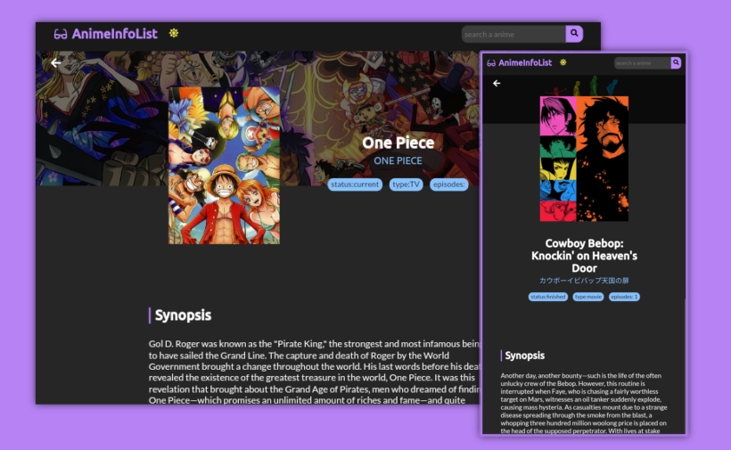

# AnimeInfoList

<div align="center" style="margin-bottom: 10px">
  <a href="README.md" style="margin-right: 10px">🇧🇷 PT-BR </a>
  <span> (Selected) 🇺🇲 EN</span>
</div>




> View the informations from your favorites anime in an interface made with ReactJs ans using the KitsuAPI

## 🐢 Getting started
Before you go to the next steps, look a bit at how project was [structured](STRUCTURE.md), it maybe of great help to you

## 💻 Prerequisites
Realize Nodejs installation from the link:
- [Node LTS](https://nodejs.org/en/)

Or install from your distro's package manager following this [steps](https://nodejs.org/en/download/package-manager/).

## 🚀 Installation

[Download](https://github.com/sennshi/Anime-Info-List/archive/refs/heads/main.zip) the project or clone it using `git clone https://github.com/sennshi/Anime-Info-List.git`

To install necessary packages run:

```
> npm install
```

And finally run:

```
> npm start
```

just access `http://localhost:3000/` to see the project.

## 🛠️ Maked with

The project used [KitsuAPI](https://kitsu.docs.apiary.io/#) that distribute the anime information, and used the following technologies to be made:


[⬆ Back to the top](#)<br>

---

made with 💜 by [Rodrigo Sennshi](https://github.com/sennshi)