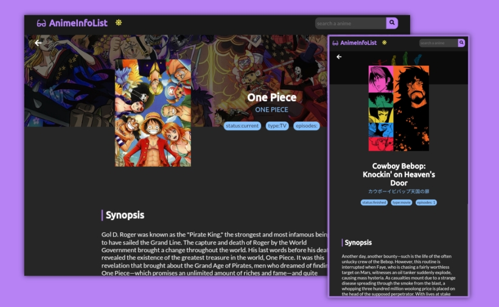

# AnimeInfoList

<div align="center" style="margin-bottom: 10px">
  <span style="margin-right: 10px">(Selecionado)🇧🇷 PT-BR</span>
  <a href="README.en.md"> 🇺🇲 EN</a>
</div>




> Visualize informações sobre seus animes favoritos, em uma interface criado com ReactJs e utilizando a KitsuAPI

## 🐢 Começando
Antes de passar para as próximas etapas, olhe um pouco de como o projeto foi [estruturado](STRUCTURE.md), pode ser de grande ajuda para você

## 💻 Pré-requisitos
Realize a instalação do NodeJS pelo link:
- [Node LTS](https://nodejs.org/en/)

Ou instale pelo seu gerenciador de pacotes de sua distro seguindo essas [etapas](https://nodejs.org/en/download/package-manager/).

## 🚀 Instalação

Faça o [download](https://github.com/sennshi/Anime-Info-List/archive/refs/heads/main.zip) do projeto ou clone utilizando `git clone https://github.com/sennshi/Anime-Info-List.git`

Rode para instalar os pacotes necessários:
```
> npm install
```

E por fim rode:

```
> npm start
```

Basta acessar `http://localhost:3000/` para visualizar o projeto.

## 🛠️ Construído com

O projeto utilizou a [KitsuAPI](https://kitsu.docs.apiary.io/#) que distribui as informações dos animes, e utilizou as seguintes tecnologias para ser feita:


[⬆ Voltar ao topo](#)<br>

---

feito com 💜 por [Rodrigo Sennshi](https://github.com/sennshi)